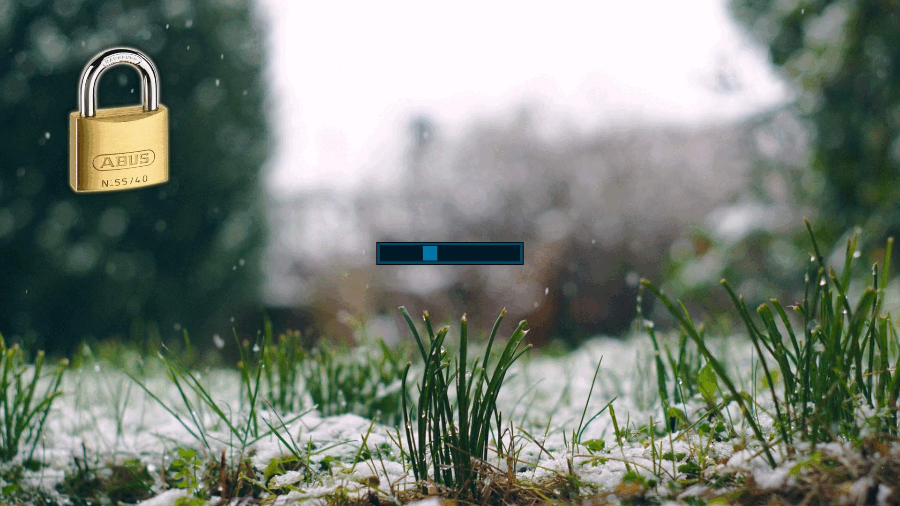

# slock

This is [my build](https://github.com/ghesy/slock) of
[slock](https://tools.suckless.org/slock), a simple X display locker.

## Added features

### Background image

Using the added utility called `slockimg`, you can set a background
image for slock.

`slockimg` adds an overlay image to the background image,
which by default is a picture of a padlock.

You can change the overlay image by changing the `overlay.png` file.
The size and position of the overlay can be configured in `config.h`.

Note: `slockimg` requires *imagemagick*.

### Input indicator

Inspired by `i3lock`'s circle-shaped input indicator, there is a
square that moves around in a rectangle to indicate key presses.

The colors and sizes of the indicator's elements can be
configured in `config.h`.

### Keyboard layout fix

If you have multiple keyboard layouts, slock switches to your main keyboard
layout and restore your previous keyboard layout after unlocking.

## Applied patches

- [dpms](https://tools.suckless.org/slock/patches/dpms),
modified to work even when DPMS variables are zero.

- [capscolor](https://tools.suckless.org/slock/patches/capscolor),
modified to work with the input indicator, of course.

- [mediakeys](https://tools.suckless.org/slock/patches/mediakeys)
